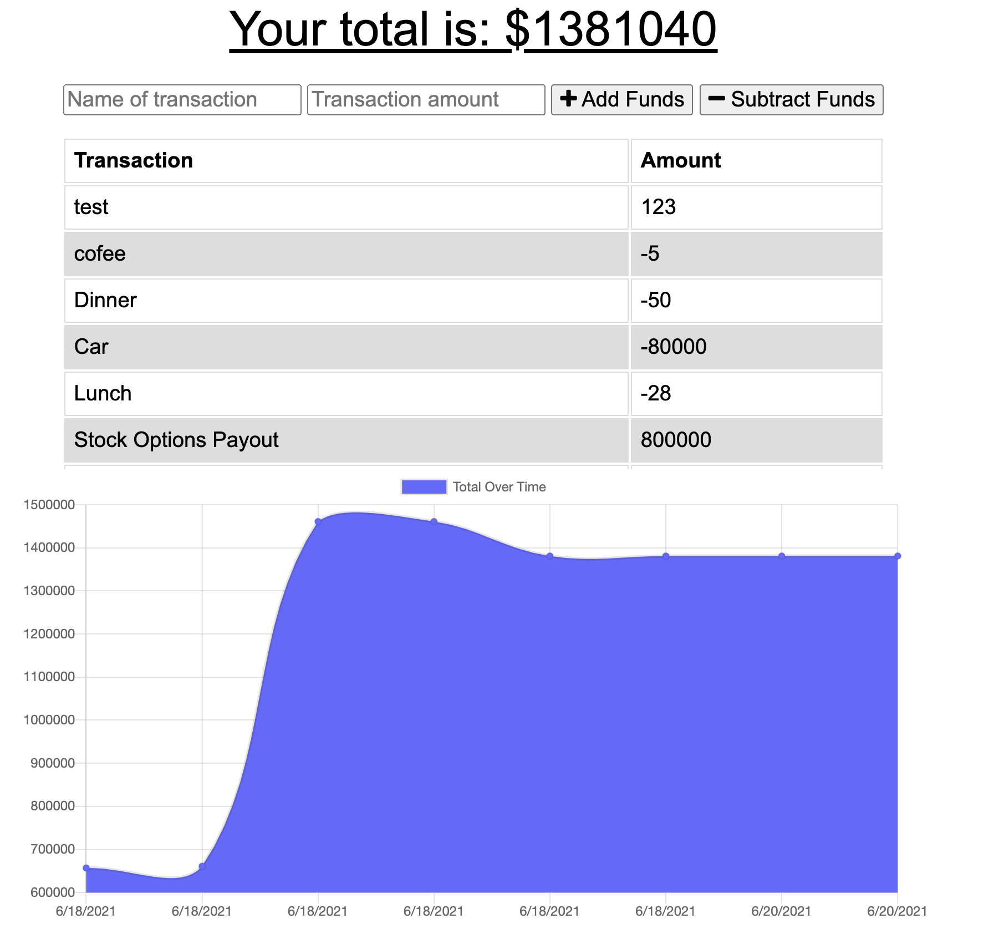

# Budget Tracker

  ## Description
  This is a PWA application that allows users to keep track of their credits and debits. It supports offline functionality and is intended for users on-the-go who may not always have the most reliable service.

  

  ## Table of Contents

  * [Installation](#installation)
  * [Usage](#usage)
  * [Contributing](#contributing)
  * [Questions](#questions)

  ## Installation
  To install the application, you can visit the web version [here](https://leahbudgettracker.herokuapp.com/). You can use the application through the browser, or you can install it on your desktop or your mobile device by selected the arrow in the URL bar.

  ## Usage
  To use the application, a user can choose to add funds or subtract funds based on their recent transactions. They can do this by inputting their information and selecting the appropriate buttons.

  ## Contributing
  To contribute to the application, you can create an issue in the issues tab at this github project [here](https://github.com/squidbeaks/budget-tracker). You can also create a Pull Request with your proposed changes.

  ## Questions?
  Reach me at [Github](https://github.com/squidbeaks) or [email](leahsigridrussell@gmail.com)!
